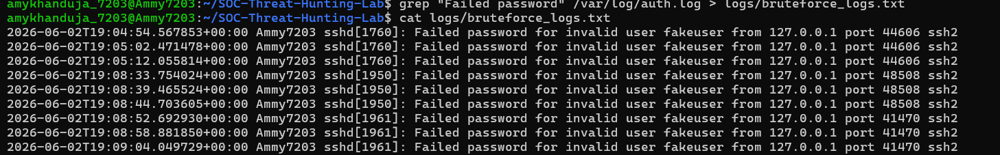
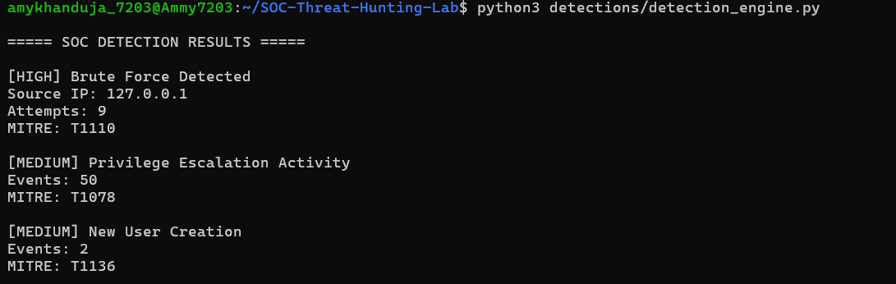
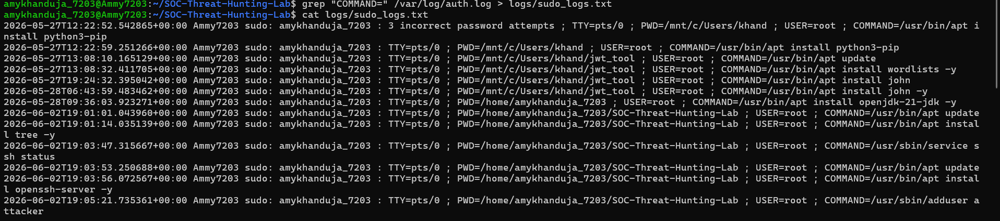
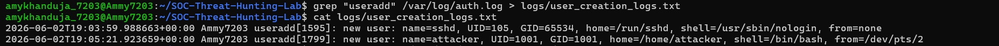
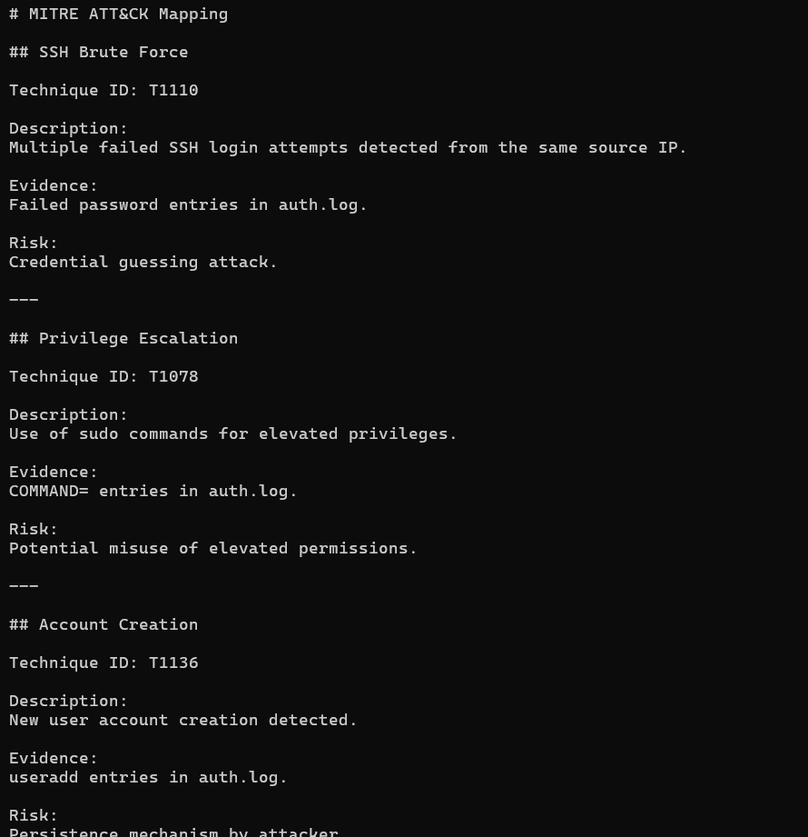
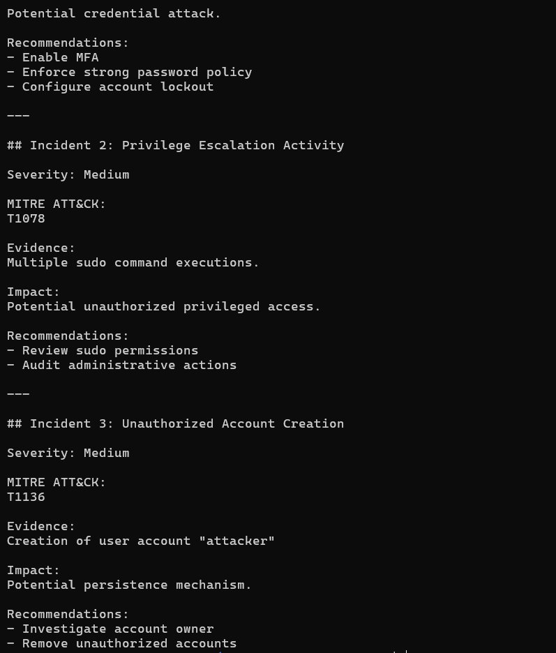
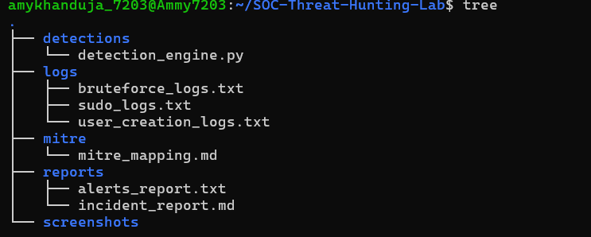

# SOC Threat Detection & Hunting Lab

## Overview

This project demonstrates a Linux-based Security Operations Center (SOC) lab built to simulate real-world security incidents and investigate malicious activities using custom Python detections.

The lab focuses on detecting:

- SSH Brute Force Attacks
- Privilege Escalation Activity
- Unauthorized User Creation

All detections are mapped to the MITRE ATT&CK framework and documented through incident response reports.

---

## Project Architecture

Attack Simulation
↓
Linux Authentication Logs (/var/log/auth.log)
↓
Python Detection Engine
↓
Security Alerts
↓
MITRE ATT&CK Mapping
↓
Incident Investigation Report

---

## Technologies Used

- Ubuntu Linux
- OpenSSH
- Python 3
- Linux Authentication Logs
- MITRE ATT&CK Framework

---

## Attack Simulation

### 1. SSH Brute Force Attack

A brute-force attack was simulated against an SSH service using invalid credentials.

Generated Logs:

- Failed password
- Authentication failure
- Invalid user

MITRE Mapping:

- T1110 - Brute Force

---

### 2. Privilege Escalation Activity

Administrative commands were executed using sudo.

Generated Logs:

- sudo command execution
- elevated privilege sessions

MITRE Mapping:

- T1078 - Valid Accounts

---

### 3. Unauthorized User Creation

A new Linux account was created.

Generated Logs:

- useradd
- groupadd

MITRE Mapping:

- T1136 - Create Account

---

## Detection Engine

The custom Python detection engine parses Linux authentication logs and generates alerts based on predefined detection logic.

Current Detections:

- Brute Force Detection
- Privilege Escalation Detection
- User Creation Monitoring

Example Alert:

```text
===== SOC DETECTION RESULTS =====

[HIGH] Brute Force Detected
Source IP: 127.0.0.1
Attempts: 9

MITRE: T1110
```

---

## MITRE ATT&CK Mapping

| Activity | Technique ID | Technique |
|-----------|------------|------------|
| SSH Brute Force | T1110 | Brute Force |
| Privilege Escalation Activity | T1078 | Valid Accounts |
| User Creation | T1136 | Create Account |

---

## Evidence Collected

Authentication logs were analyzed from:

```text
/var/log/auth.log
```

Evidence files:

```text
logs/
├── bruteforce_logs.txt
├── sudo_logs.txt
└── user_creation_logs.txt
```

---

## Screenshots

### Brute Force Evidence



### Detection Engine Output



### Privilege Escalation Logs



### User Creation Logs



### MITRE Mapping



### Incident Report



### Project Structure



---

## Incident Response

The project includes:

- Alert Investigation
- MITRE ATT&CK Mapping
- Incident Documentation
- Security Recommendations

Files:

```text
reports/
├── alerts_report.txt
└── incident_report.md
```

---

## Future Improvements

- Real-Time Monitoring
- Wazuh SIEM Integration
- Sigma Rule Detection
- Email Alerting
- Threat Intelligence Integration

---

## Author

Amratya Khanduja

Cybersecurity | SOC | Threat Hunting | Blue Team
