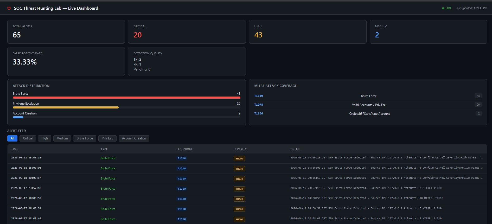

# SOC Threat Detection & Hunting Lab

>SOC Threat Hunting Lab is a custom-built security monitoring platform that performs real-time analysis of Linux authentication logs to detect suspicious activities such as SSH brute-force attacks, privilege escalation attempts, and account creation events. The project integrates MITRE ATT&CK mapping, confidence-based alert scoring, dynamic severity classification, alert suppression, and TP/FP tracking to simulate real-world SOC detection engineering workflows. A live dashboard provides visibility into alerts, detection quality metrics, and false positive rates.
## Dashboard Preview

======
---

## What This Project Does

* Monitors Linux authentication logs (`auth.log`) in real time.
* Detects SSH brute-force attacks, privilege escalation attempts, and account creation events.
* Maps detections to relevant MITRE ATT&CK techniques.
* Assigns confidence scores and dynamically classifies alert severity.
* Reduces alert noise through alert suppression mechanisms.
* Stores indicators of compromise (IOCs) and alert data for analysis.
* Provides a live SOC dashboard for monitoring security events.
* Supports analyst review workflows through True Positive (TP) and False Positive (FP) classification.
* Calculates detection quality metrics, including False Positive Rate (FPR).
* Helps evaluate and improve the effectiveness of security detections.


---

## Architecture

```
Attack Simulation
(SSH Brute Force | Sudo Abuse | User Creation)
                     │
                     ▼
            /var/log/auth.log
        (Linux Authentication Logs)
                     │
                     ▼
         realtime_monitor.py
      (Real-Time Detection Engine)
                     │
     ┌───────────────┼───────────────┐
     │               │               │
     ▼               ▼               ▼
SSH Brute      Privilege       Account
Force          Escalation      Creation
(T1110)         (T1078)         (T1136)
     │               │               │
     └───────────────┼───────────────┘
                     ▼
          Alert Processing Layer
      • Confidence Scoring
      • Dynamic Severity
      • Alert Suppression
                     │
                     ▼
             Storage Layer
      ├── alerts/alerts.json
      ├── iocs/iocs.json
      └── logs/*.txt
                     │
          ┌──────────┴──────────┐
          ▼                     ▼
 Detection Quality       MITRE Mapping
      • TP/FP              • T1110
      • FPR                • T1078
      • Health Metrics     • T1136
          │                     │
          └──────────┬──────────┘
                     ▼
                server.py
       (Pure Python HTTP Server)
                     │
                     ▼
          dashboard/index.html
            (Live SOC Dashboard)
                     │
     ┌───────────────┼───────────────┐
     ▼               ▼               ▼
 Alert Feed    Attack Stats    Detection Quality
                                     &
                              False Positive Rate
```

## Attack Coverage
________________________________________________________________________________________________________
| Attack Type          | How Simulated                                     | MITRE Technique | Severity |
|----------------------|---------------------------------------------------|-----------------|----------|
| SSH Brute Force      | `ssh fakeuser@localhost` repeated failed attempts | T1110           | HIGH     |
| Privilege Escalation | `sudo` commands on sensitive files                | T1078           | CRITICAL |
| Account Creation     | `sudo useradd` new users                          | T1136           | MEDIUM   |
| Successful Login     | `ssh $USER@localhost` with correct password       | T1078           | MEDIUM   |
---------------------------------------------------------------------------------------------------------
---

## Project Structure

```
SOC-Threat-Hunting-Lab/
|
|--alerts/
| |--alerts.json                   #Alert Review Workflow
| |--review.json                   #TP/FP tracking
|
├── detections/
│   ├── detection_engine.py        # Static log analyser
│   └── realtime_monitor.py        # Live tail-based detection engine
├── iocs/
│   └── iocs.json                  # Auto-populated IOC store
├── logs/
│   ├── bruteforce_logs.txt        # T1110 alerts
│   ├── sudo_logs.txt              # T1078 alerts
│   └── user_creation_logs.txt     # T1136 alerts
|--metrics.py                      # False Positive Rate Calculation
├── mitre/
│   └── mitre_mapping.md           # ATT&CK technique documentation
├── reports/
│   ├── alerts_report.txt          # Generated alert summaries
│   └── incident_report.md         # Full IR documentation
├── screenshots/                   # Evidence for reporting
├── sigma_rules/
│   ├── ssh_bruteforce.yml         # Sigma rule — T1110
│   ├── privilege_escalation.yml   # Sigma rule — T1078
│   └── user_creation.yml          # Sigma rule — T1136
├── dashboard/
│   └── index.html                 # Live SPA dashboard
├── server.py                      # Pure Python backend (no Flask)
├── start_dashboard.sh             # One-command startup
└── README.md
```

---

## How to Run

### 1. Start SSH service

sudo service ssh start


### 2. Start the detection engine

sudo python3 detections/realtime_monitor.py


### 3. Start the dashboard (new terminal)

start_dashboard.sh

Dashboard opens at **http://localhost:8000**

### 4. To Mark any alert as TP/FP

python3 review_alert.py ALERT_ID TP/FP


## 5. View Detection Metrics

python3 metrics.py

---

## Simulating Attacks Manually

**Brute Force (T1110)**

ssh fakeuser@localhost
then enter wrong password  

**Privilege Escalation (T1078)**

sudo cat /etc/shadow
sudo whoami
sudo cat /etc/sudoers


**Account Creation (T1136)**

sudo useradd -m attacker
sudo userdel -r attacker


**Successful Login — Valid Accounts (T1078)**

ssh $USER@localhost


---

## Recent Enhancements

### Confidence-Based Detection Scoring

The SSH Brute Force detection engine now assigns a confidence score based on the number of failed authentication attempts observed from a source IP.

| Failed Attempts | Confidence |
| --------------- | ---------- |
| 3+              | 40%        |
| 5+              | 70%        |
| 10+             | 100%       |

This helps prioritise alerts and reduces analyst fatigue by providing a quantitative measure of detection confidence.

---

### Dynamic Severity Classification

Alert severity is now calculated automatically from confidence scores.

| Confidence | Severity |
| ---------- | -------- |
| 0–39%      | Low      |
| 40–59%     | Medium   |
| 60–79%     | High     |
| 80–100%    | Critical |

This enables risk-based alert prioritisation similar to modern SOC workflows.

---

### Alert Suppression & Noise Reduction

To reduce duplicate alerts and alert fatigue, the engine suppresses repeated alerts when severity remains unchanged.

Example:

* 3 failed attempts → Medium Alert
* 4 failed attempts → Suppressed
* 5 failed attempts → High Alert
* 6–9 failed attempts → Suppressed
* 10 failed attempts → Critical Alert

This significantly reduces alert noise while preserving important escalation events.

---

### False Positive Tracking Framework

A review workflow has been implemented to support detection quality assessment.

Each alert is stored with:

* Unique Alert ID
* Timestamp
* Severity
* Confidence Score
* Review Status

Review statuses:

* Pending
* TP (True Positive)
* FP (False Positive)

This enables structured alert validation and continuous detection improvement.

---

### Detection Quality Metrics

A dedicated metrics module calculates:

* Total Alerts
* True Positives (TP)
* False Positives (FP)
* Pending Reviews
* False Positive Rate (FPR)

Formula:

FPR = FP / (TP + FP) × 100

This provides measurable insight into detection accuracy and rule effectiveness.


---
## Dashboard Features

- **4 live stat cards** — Total alerts, Critical, High, Medium (auto-refresh every 3s)
- **Attack distribution chart** — Bar graph of T1110 / T1078 / T1136 hit counts
- **MITRE ATT&CK coverage panel** — Live technique mapping
- **Alert feed table** — Filterable by severity and attack type
- **IOC tracker** — Source IPs, timestamps, technique tags
- **IST timestamps** — All alerts in Indian Standard Time

---

## Detection Logic

### Brute Force (T1110)
- Monitors `/var/log/auth.log` for `Failed password` entries
- Tracks per-IP attempt count using a Counter
- Fires HIGH alert after 3+ attempts from same IP
- Saves to `logs/bruteforce_logs.txt` + `iocs/iocs.json`

### Privilege Escalation (T1078)
- Detects `sudo` + `COMMAND` pattern in auth.log
- Extracts username and command executed
- Fires CRITICAL alert immediately
- Saves to `logs/sudo_logs.txt`

### Account Creation (T1136)
- Detects `new user` / `useradd` entries
- Fires MEDIUM alert
- Saves to `logs/user_creation_logs.txt`

### Successful Login
- Detects `Accepted password` / `Accepted publickey`
- Fires MEDIUM alert — valid credential use is suspicious post-brute-force
- Tagged as T1078 Valid Accounts

---

## Sigma Rules

Standard Sigma-format detection rules included for all three techniques — portable to any SIEM (Splunk, Elastic, Microsoft Sentinel).

```yaml
# Example — ssh_bruteforce.yml
title: SSH Brute Force Attempt
status: experimental
logsource:
    product: linux
    service: auth
detection:
    keywords:
        - 'Failed password'
condition: keywords | count() > 3
level: high
tags:
    - attack.credential_access
    - attack.t1110
```

---

## Skills Demonstrated
_______________________________________________________________________________________________________
| Area                         | What Was Done                                                         |
|------------------------------|-----------------------------------------------------------------------|
| Detection Engineering        | Built custom Python engine parsing real Linux auth logs               |
| Threat Hunting               | Correlated failed logins, privilege events, account creation          |
| MITRE ATT&CK                 | Mapped all detections to T1110, T1078, T1136                          |
| Incident Response            | Produced structured IR reports with root-cause and remediation        |
| Sigma Rules                  | Wrote portable detection rules for all three techniques               |
| Dashboard / Visualisation    | Built zero-dependency live SPA with Python HTTP server                |
| IOC Management               | Auto-populated IOC store with IP, timestamp, technique, severity      |
|Detection Tuning              | Implemented confidence scoring, severity mapping and alert suppression|
|Detection Quality Engineering | Built TP/FP review workflow and False Positive Rate tracking          |
-------------------------------------------------------------------------------------------------------
---

## Environment

- **OS:** Ubuntu (WSL2 on Windows)
- **Language:** Python 3 (zero external dependencies for server)
- **Log Source:** `/var/log/auth.log` (real system logs)
- **Dashboard:** Pure HTML/CSS/JS SPA
- **Backend:** Python `http.server` (built-in)

---

*Built as part of cybersecurity undergraduate coursework at National Forensic Sciences University, Delhi.*
